# Supported Controls & Properties

FrxEdit and its schema validation engine fully support the core 15 MS-Forms controls. The following diagrams define the supported properties, their expected JSON types, and valid values.

*Note: All controls implicitly support basic layout properties like `name` (string), `left` (number), `top` (number), `width` (number), `height` (number), `tabIndex` (integer), and `tabStop` (boolean).*

## Control Property Schemas

```mermaid
classDiagram
    class UserForm {
        +string caption
        +string backColor (Hex/System)
        +string foreColor (Hex/System)
        +boolean enabled
        +string fontName
        +float fontSize
        +boolean fontBold
        +boolean fontItalic
        +uint16 pictureAlignment (0-4)
        +uint16 pictureSizeMode (0-3)
        +boolean pictureTiling
        +uint16 scrollBars (0-3)
        +boolean keepScrollBarsVisible
        +int32 scrollHeight (Twips)
        +int32 scrollWidth (Twips)
        +int32 scrollLeft (Twips)
        +int32 scrollTop (Twips)
        +boolean rightToLeft
        +uint16 mousePointer (0-15, 99)
        +string mouseIcon (Base64/File)
    }

    class CommandButton {
        +string caption
        +string backColor
        +string foreColor
        +boolean enabled
        +boolean locked
        +boolean wordWrap
        +boolean autoSize
        +boolean default
        +boolean cancel
        +boolean takeFocusOnClick
        +string fontName
        +float fontSize
        +int32 picturePosition (0-12)
        +uint16 mousePointer (0-15, 99)
        +string mouseIcon (Base64/File)
    }

    class TextBox {
        +string text
        +string value
        +string backColor
        +string foreColor
        +boolean enabled
        +boolean locked
        +boolean autoSize
        +boolean autoWordSelect
        +boolean autoTab
        +boolean dragBehavior
        +boolean hideSelection
        +boolean multiLine
        +boolean wordWrap
        +boolean selectionMargin
        +int32 maxLength
        +string passwordChar
        +uint16 textAlign (1-3)
        +uint16 scrollBars (0-3)
        +uint16 specialEffect (0-6)
        +uint16 borderStyle (0-1)
        +string borderColor
        +uint16 mousePointer (0-15, 99)
        +string mouseIcon (Base64/File)
    }

    class Label {
        +string caption
        +string backColor
        +string foreColor
        +boolean enabled
        +boolean autoSize
        +boolean wordWrap
        +string accelerator
        +uint16 textAlign (1-3)
        +uint16 specialEffect (0-6)
        +uint16 borderStyle (0-1)
        +string borderColor
        +uint16 mousePointer (0-15, 99)
        +string mouseIcon (Base64/File)
    }

    class CheckBox {
        +string caption
        +string value (True/False/Null)
        +string backColor
        +string foreColor
        +boolean enabled
        +boolean locked
        +boolean autoSize
        +boolean wordWrap
        +boolean tripleState
        +string accelerator
        +uint16 textAlign (1-3)
        +uint16 specialEffect (0-6)
        +uint16 alignment (0-1)
        +uint16 mousePointer (0-15, 99)
        +string mouseIcon (Base64/File)
    }

    class OptionButton {
        +string caption
        +string value (True/False/Null)
        +string backColor
        +string foreColor
        +boolean enabled
        +boolean locked
        +boolean autoSize
        +boolean wordWrap
        +boolean tripleState
        +string accelerator
        +uint16 textAlign (1-3)
        +uint16 specialEffect (0-6)
        +uint16 alignment (0-1)
        +string groupName
        +uint16 mousePointer (0-15, 99)
        +string mouseIcon (Base64/File)
    }

    class ToggleButton {
        +string caption
        +string value (True/False/Null)
        +string backColor
        +string foreColor
        +boolean enabled
        +boolean locked
        +boolean autoSize
        +boolean wordWrap
        +boolean tripleState
        +string accelerator
        +uint16 textAlign (1-3)
        +int32 picturePosition (0-12)
        +uint16 mousePointer (0-15, 99)
        +string mouseIcon (Base64/File)
    }
```

## Containers & Advanced Controls

```mermaid
classDiagram
    class Frame {
        +string caption
        +string backColor
        +string foreColor
        +boolean enabled
        +uint16 scrollBars (0-3)
        +boolean keepScrollBarsVisible
        +int32 scrollHeight (Twips)
        +int32 scrollWidth (Twips)
        +int32 scrollLeft (Twips)
        +int32 scrollTop (Twips)
        +uint16 specialEffect (0-6)
        +uint16 borderStyle (0-1)
        +string borderColor
        +uint16 mousePointer (0-15, 99)
        +string mouseIcon (Base64/File)
    }

    class MultiPage {
        +string backColor
        +string foreColor
        +boolean enabled
        +uint16 style (0-2)
        +uint16 tabOrientation (0-3)
        +boolean multiRow
        +int32 value (Active Page Index)
        +uint16 mousePointer (0-15, 99)
        +string mouseIcon (Base64/File)
    }
    
    class Page {
        +string caption
        +boolean enabled
        +string accelerator
        +boolean transitionEffect
        +int32 transitionPeriod (ms)
    }
    
    class TabStrip {
        +string backColor
        +string foreColor
        +boolean enabled
        +uint16 style (0-2)
        +uint16 tabOrientation (0-3)
        +boolean multiRow
        +int32 value
        +uint16 mousePointer (0-15, 99)
        +string mouseIcon (Base64/File)
    }

    class ComboBox {
        +string text
        +string value
        +string backColor
        +string foreColor
        +boolean enabled
        +boolean locked
        +boolean autoSize
        +boolean autoWordSelect
        +boolean autoTab
        +boolean hideSelection
        +boolean selectionMargin
        +int32 maxLength
        +uint16 textAlign (1-3)
        +uint16 style (0-2)
        +uint16 matchEntry (0-2)
        +int32 listRows
        +uint16 specialEffect (0-6)
        +uint16 borderStyle (0-1)
        +string borderColor
        +uint16 mousePointer (0-15, 99)
        +string mouseIcon (Base64/File)
    }

    class ListBox {
        +string value
        +string backColor
        +string foreColor
        +boolean enabled
        +boolean locked
        +uint16 textAlign (1-3)
        +uint16 matchEntry (0-2)
        +uint16 multiSelect (0-2)
        +uint16 specialEffect (0-6)
        +uint16 borderStyle (0-1)
        +string borderColor
        +uint16 mousePointer (0-15, 99)
        +string mouseIcon (Base64/File)
    }

    class ScrollBar {
        +int32 value
        +int32 min
        +int32 max
        +int32 smallChange
        +int32 largeChange
        +string backColor
        +string foreColor
        +boolean enabled
        +boolean proportionalThumb
        +int32 orientation (0-1)
        +uint16 mousePointer (0-15, 99)
        +string mouseIcon (Base64/File)
    }

    class SpinButton {
        +int32 value
        +int32 min
        +int32 max
        +int32 smallChange
        +string backColor
        +string foreColor
        +boolean enabled
        +int32 orientation (0-1)
        +uint16 mousePointer (0-15, 99)
        +string mouseIcon (Base64/File)
    }

    class Image {
        +string backColor
        +string foreColor
        +boolean enabled
        +boolean autoSize
        +uint16 pictureAlignment (0-4)
        +uint16 pictureSizeMode (0-3)
        +boolean pictureTiling
        +uint16 specialEffect (0-6)
        +uint16 borderStyle (0-1)
        +string borderColor
        +uint16 mousePointer (0-15, 99)
        +string mouseIcon (Base64/File)
    }

    MultiPage *-- Page : contains
```

## Enum Value References
For properties requiring an integer enum, FrxEdit uses the standard MS-Forms VBA constants exactly as defined by Microsoft. Use the integer values below in your JSON patches.

### fmPictureAlignment (`pictureAlignment`)
* `0`: fmPictureAlignmentTopLeft
* `1`: fmPictureAlignmentTopRight
* `2`: fmPictureAlignmentCenter
* `3`: fmPictureAlignmentBottomLeft
* `4`: fmPictureAlignmentBottomRight

### fmPictureSizeMode (`pictureSizeMode`)
* `0`: fmPictureSizeModeClip
* `1`: fmPictureSizeModeStretch
* `3`: fmPictureSizeModeZoom

### fmScrollBars (`scrollBars`)
* `0`: fmScrollBarsNone
* `1`: fmScrollBarsHorizontal
* `2`: fmScrollBarsVertical
* `3`: fmScrollBarsBoth

### fmPicturePosition (`picturePosition`)
* `0`: fmPicturePositionLeftTop
* `1`: fmPicturePositionLeftCenter
* `2`: fmPicturePositionLeftBottom
* `3`: fmPicturePositionRightTop
* `4`: fmPicturePositionRightCenter
* `5`: fmPicturePositionRightBottom
* `6`: fmPicturePositionAboveLeft
* `7`: fmPicturePositionAboveCenter
* `8`: fmPicturePositionAboveRight
* `9`: fmPicturePositionBelowLeft
* `10`: fmPicturePositionBelowCenter
* `11`: fmPicturePositionBelowRight
* `12`: fmPicturePositionCenter

### fmTextAlign (`textAlign`)
* `1`: fmTextAlignLeft
* `2`: fmTextAlignCenter
* `3`: fmTextAlignRight

### fmSpecialEffect (`specialEffect`)
* `0`: fmSpecialEffectFlat
* `1`: fmSpecialEffectRaised
* `2`: fmSpecialEffectSunken
* `3`: fmSpecialEffectEtched
* `6`: fmSpecialEffectBump

### fmBorderStyle (`borderStyle`)
* `0`: fmBorderStyleNone
* `1`: fmBorderStyleSingle

### fmAlignment (`alignment`)
* `0`: fmAlignmentLeft
* `1`: fmAlignmentRight

### fmTabStyle (`style`)
* `0`: fmTabStyleTabs
* `1`: fmTabStyleButtons
* `2`: fmTabStyleNone

### fmTabOrientation (`tabOrientation`)
* `0`: fmTabOrientationTop
* `1`: fmTabOrientationBottom
* `2`: fmTabOrientationLeft
* `3`: fmTabOrientationRight

### fmMatchEntry (`matchEntry`)
* `0`: fmMatchEntryFirstLetter
* `1`: fmMatchEntryComplete
* `2`: fmMatchEntryNone

### fmMultiSelect (`multiSelect`)
* `0`: fmMultiSelectSingle
* `1`: fmMultiSelectMulti
* `2`: fmMultiSelectExtended

### fmOrientation (`orientation`)
* `-1`: fmOrientationAuto
* `0`: fmOrientationVertical
* `1`: fmOrientationHorizontal

### fmMousePointer (`mousePointer`)
* `0`: fmMousePointerDefault
* `1`: fmMousePointerArrow
* `2`: fmMousePointerCross
* `3`: fmMousePointerIBeam
* `6`: fmMousePointerNESW
* `7`: fmMousePointerNS
* `8`: fmMousePointerNWSE
* `9`: fmMousePointerWE
* `10`: fmMousePointerUpArrow
* `11`: fmMousePointerHourGlass
* `12`: fmMousePointerNoDrop
* `13`: fmMousePointerAppStarting
* `14`: fmMousePointerHelp
* `15`: fmMousePointerSizeAll
* `99`: fmMousePointerCustom

## Color Properties

Properties like `backColor`, `foreColor`, and `borderColor` accept three different formats:

1. **Web Hex Format**: The standard web format `"#RRGGBB"` (e.g., `"#FF0000"` for pure red). FrxEdit automatically translates this to the internal MS-Forms `0x00BBGGRR` format.
2. **Legacy VBA Format**: The exact VBA hex format `"&H00BBGGRR&"`.
3. **System Colors**: A literal string representing a native OS system color.

### Supported System Colors
The following literal strings can be used to assign dynamic OS UI colors:
* `"systemScrollbar"`
* `"systemBackground"`
* `"systemActiveCaption"`
* `"systemInactiveCaption"`
* `"systemMenu"`
* `"systemWindow"`
* `"systemWindowFrame"`
* `"systemMenuText"`
* `"systemWindowText"`
* `"systemCaptionText"`
* `"systemActiveBorder"`
* `"systemInactiveBorder"`
* `"systemAppWorkspace"`
* `"systemHighlight"`
* `"systemHighlightText"`
* `"systemButtonFace"`
* `"systemButtonShadow"`
* `"systemGrayText"`
* `"systemButtonText"`
* `"systemInactiveCaptionText"`
* `"systemButtonHighlight"`
* `"system3DDarkShadow"`
* `"system3DLight"`
* `"systemInfoText"`
* `"systemInfoBackground"`
